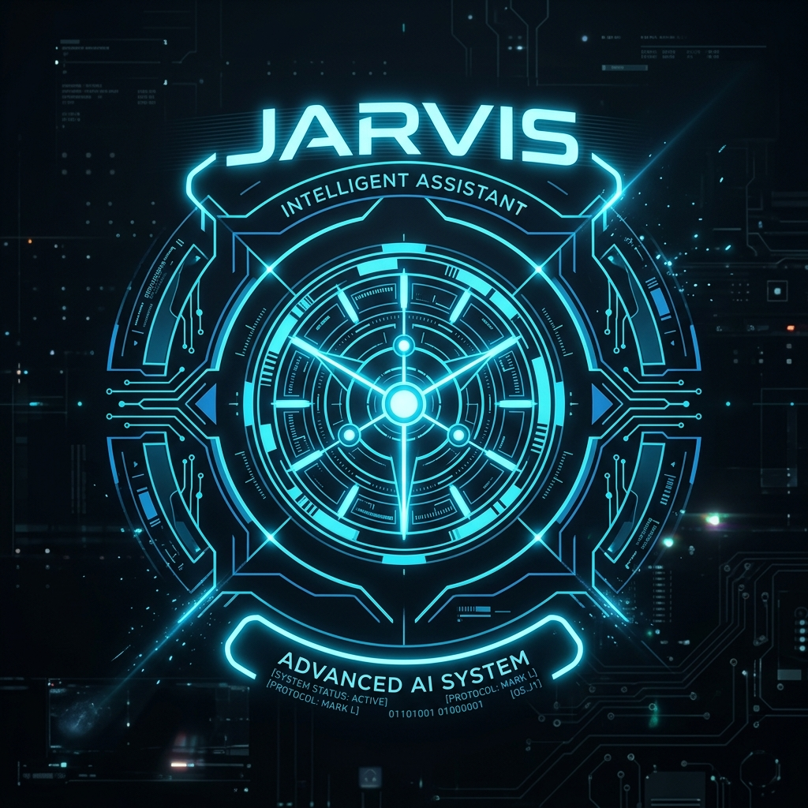

# J.A.R.V.I.S — Just A Rather Very Intelligent System

<p align="center">
  
</p>

<p align="center">
  
  
  
  
  
  
</p>

---


> *"Welcome back, Sir. All systems are initialized and standing by for your command."*

**JARVIS** is a production-grade, AI-powered workstation orchestrator and voice assistant inspired by Tony Stark's legendary system. It's designed to be more than just a chatbot; it's a bridge between natural language and your Windows system, capable of controlling your hardware, managing your files, browsing the web, and automating your digital life.

---

## 📺 Dashboard Preview

The JARVIS interface is a high-performance HUD designed for maximum utility and aesthetic appeal.

<p align="center">
  
</p>


- **Dynamic HUD**: Real-time system metrics, animated arc reactor, and waveform visualizer.
- **Glassmorphism Design**: A sleek, cyberpunk dark theme that feels premium.
- **Voice-First Interaction**: Fully hands-free control with wake-word detection.

---

## 🚀 Quick Start

Getting JARVIS up and running on your local machine is simple.

### Prerequisites
- **Python 3.10+**
- **Node.js** (for the Next.js version)
- **API Keys**: A free [Gemini API key](https://aistudio.google.com) and an [OpenWeatherMap key](https://openweathermap.org/api).

### Installation

1. **Clone the Repository**:
   ```bash
   git clone https://github.com/yourusername/Jarvis-AI.git
   cd Jarvis-AI
   ```

2. **Launch JARVIS**:
   The easiest way is to use the included batch launcher:
   ```bash
   # One-click startup (Windows)
   start_jarvis.bat
   ```

3. **Manual Startup**:
   If you prefer manual control:
   ```bash
   # Terminal 1: Backend
   python server.py

   # Terminal 2: Frontend
   python -m http.server 5500
   ```
   Then open `http://127.0.0.1:5500` in your browser.

---

## 🛠️ Tech Stack & Architecture

JARVIS is built on a modular architecture that separates system-level logic from the user interface.

| Layer | Technology | Description |
|---|---|---|
| **AI Brain** | Google Gemini 2.0 Flash | Handles complex reasoning and natural conversation. |
| **Backend** | Python Flask | The bridge between the web UI and Windows system calls. |
| **Frontend** | HTML5, Vanilla JS, CSS3 | A lightweight, high-performance cyberpunk HUD. |
| **Automation** | PowerShell / subprocess | Deep system integration for controlling apps and settings. |
| **Computer Vision** | OpenCV + YOLOv8 | Real-time object detection and visual analysis. |
| **Speech** | Web Speech API / Vosk | Online and offline speech recognition and synthesis. |

---

## 🧠 Core Capabilities

### 🖥️ System Command & Control
- **App Launcher**: Open any application (VS Code, Chrome, Spotify) using fuzzy name matching.
- **Hardware Control**: Adjust volume, brightness, and power states (shutdown/restart) via voice.
- **System Monitoring**: Live tracking of CPU, RAM, disk, and battery health.
- **Screenshots**: Instant capture and save to your desktop.

### 🌐 Intelligence & Research
- **Web Search**: Real-time results from DuckDuckGo (no API key required).
- **Web Browsing**: Fetch and summarize any webpage content using Gemini.
- **Knowledge Base**: Instant Wikipedia summaries and dictionary definitions.
- **Finance**: Live stock prices (Yahoo Finance) and crypto data (CoinGecko).

### 📱 Communication & Automation
- **WhatsApp Integration**: Send messages to contacts or direct numbers via WhatsApp Desktop.
- **Email & SOS**: Quick email dispatch and an emergency SOS system with location tracking.
- **Task Management**: Voice-controlled To-Do list persisted to local storage.
- **Voice Notes**: Create and search through text notes saved on your machine.

### 📷 Advanced AI Features
- **Gemini Vision**: JARVIS can "see" through your webcam and describe your surroundings.
- **Object Detection**: Real-time identification of objects using the YOLOv8 model.
- **Persistent Memory**: "Sir, remember that my car keys are in the drawer."
- **PDF Intelligence**: Summarize long PDF documents into actionable bullet points.

---

## 🗣️ Try These Commands

| Category | Voice Command |
|---|---|
| **Wake Word** | *"Hey Jarvis..."* |
| **Web** | *"Search for latest AI news"* |
| **Media** | *"Play Interstellar soundtrack on YouTube"* |
| **System** | *"Open VS Code and set volume to 50%"* |
| **Messaging** | *"Send 'I'm running late' to Tony on WhatsApp"* |
| **Intelligence** | *"Summarize this PDF on my desktop"* |
| **Vision** | *"What do you see through the camera?"* |
| **Finance** | *"What's the current price of Bitcoin?"* |

---

## 📂 Project Structure

```bash
Jarvis-AI/
├── server.py             # Flask Backend (1700+ lines of system logic)
├── app.js                # Core Frontend Brain (Voice, UI, API routing)
├── index.html            # Main HUD Interface
├── style.css             # Cyberpunk UI Design System
├── jarvis-next/          # WIP: Next.js + React version of JARVIS
├── _new_endpoints.py     # Staging for upcoming API features
└── start_jarvis.bat      # Windows Auto-Launcher
```

---

## 🛠️ Troubleshooting

- **Gemini Quota**: If JARVIS stops responding to complex queries, check your Gemini API quota.
- **Microphone Access**: Ensure your browser has permission to use the microphone.
- **Dependencies**: Run `pip install -r requirements.txt` if any modules are missing.

---

## 📄 License

This project is licensed under the MIT License - see the [LICENSE](LICENSE) file for details.

---

<p align="center">
  <i>Built for the next generation of engineers. JARVIS is always evolving.</i>
</p>

